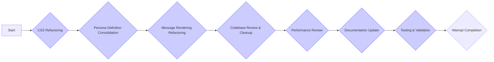

Okay, I understand. You want a comprehensive plan to enhance the AI chat system, focusing on performance, scalability, and maintainability through strategic refactoring and redundancy elimination, with simplicity as a key goal.

Here is a detailed plan to enhance the AI Chat system:

**AI Chat System Enhancement Plan**

This plan outlines the steps to refactor and enhance the AI Chat system, focusing on performance, scalability, maintainability, and simplicity.

**Step-by-Step Breakdown:**

1.  **CSS Refactoring (Estimated Time: 3-5 hours)**
    *   **Goal:** Consolidate and reorganize CSS files to eliminate redundancy, improve clarity, and maintainability.
    *   **Tasks:**
        *   **CSS Files Review:** Review `src/index.css`, `src/styles/global.css`, `src/styles/effects.css`, `src/styles/components.css`, `src/styles/animations.css`, and `src/styles/fonts.css` to identify redundant styles, conflicting definitions, and areas for improvement.
        *   **Consolidate Animations:**  Designate `src/styles/animations.css` as the single source of truth for all keyframe animations. Remove redundant animation definitions from other CSS files (e.g., `src/index.css`, `src/styles/global.css`, `src/styles/effects.css`).
        *   **Consolidate Hover Effects:** Choose a single location (e.g., `src/styles/effects.css` or create a new `src/styles/interactions.css`) for defining hover effect utility classes like `.hover-lift` and remove redundant definitions.
        *   **Consolidate Khmer Text Styling:** Designate `src/styles/fonts.css` as the single source of truth for `.khmer-text` class and remove redundant definitions from `src/index.css` and `src/styles/global.css`.
        *   **Standardize CSS Variables:** Ensure consistent use of CSS variables for theme-related values (colors, shadows, transitions, spacing) across all CSS files. Update glow effect classes in `src/styles/effects.css` to use CSS variables.
        *   **Refine CSS File Roles:** Clearly define the purpose of each CSS file (e.g., `global.css` for CSS variables and base styles, `effects.css` for effect utilities, `components.css` for component styles, `index.css` for Tailwind and entry-point styles, `fonts.css` for font-related styles, `chat.css` - if needed, for specific chat layout styles).
        *   **Actionable Steps:**
            *   Use `read_file` to re-examine each CSS file.
            *   Use `apply_diff` to remove redundant styles and consolidate definitions.
            *   Use `apply_diff` or `write_to_file` to update CSS classes to consistently use CSS variables.
            *   Use `write_to_file` to update CSS file headers with clear descriptions of their purpose.

2.  **Persona Definition Consolidation (Estimated Time: 1-2 hours)**
    *   **Goal:** Eliminate redundant persona definitions and ensure `src/config/personas.ts` is the single source of truth for persona configurations.
    *   **Tasks:**
        *   **Remove Redundant `defaultPersonas`:** Delete the `defaultPersonas` array from `src/contexts/ChatContext.tsx`.
        *   **Update Context to Use `src/config/personas.ts`:** Modify `ChatContext.tsx` to import `defaultPersonas` from `src/config/personas.ts` and use it for initial persona state.
        *   **Verify Persona Usage:** Ensure all parts of the application (especially `PersonaSelector` and `AIChat`) correctly use the persona definitions from `src/config/personas.ts`.
        *   **Actionable Steps:**
            *   Use `read_file` to examine `src/contexts/ChatContext.tsx` and `src/config/personas.ts`.
            *   Use `apply_diff` to remove the redundant `defaultPersonas` array from `src/contexts/ChatContext.tsx`.
            *   Use `apply_diff` to update imports and code in `ChatContext.tsx` to use `defaultPersonas` from `src/config/personas.ts`.
            *   Use `search_files` to verify persona usage across the project.

3.  **Message Rendering Refactoring (Estimated Time: 2-4 hours)**
    *   **Goal:** Refactor message rendering logic in `VirtualizedMessages.tsx` to reuse the `ChatMessage` component, reducing code duplication and improving maintainability.
    *   **Tasks:**
        *   **Identify Redundant Logic:** Analyze the message rendering code in `VirtualizedMessages.tsx` and compare it to the `ChatMessage` component to pinpoint redundant code (bubble styling, role icons, name display, Markdown/LaTeX rendering).
        *   **Refactor `VirtualizedMessages` to Use `ChatMessage`:** Modify `VirtualizedMessages.tsx` to render `ChatMessage` components within its mapping logic instead of duplicating the rendering code. Pass down necessary props (`content`, `role`, `isKhmerTextFn`) to `ChatMessage`.
        *   **Remove Redundant Code:** Delete the duplicated message rendering code from `VirtualizedMessages.tsx` after refactoring.
        *   **Verify UI Functionality:** Ensure the chat UI in `AIChat.tsx` and `VirtualizedMessages.tsx` still renders correctly after refactoring, and that message display and styling are consistent.
        *   **Actionable Steps:**
            *   Use `read_file` to examine `VirtualizedMessages.tsx` and `ChatMessage.tsx`.
            *   Use `apply_diff` to refactor `VirtualizedMessages.tsx` to render `ChatMessage` components.
            *   Use `apply_diff` to remove redundant message rendering code from `VirtualizedMessages.tsx`.
            *   Manually test the chat UI to verify functionality and visual consistency.

4.  **Codebase Review & Cleanup (Estimated Time: 2-3 hours)**
    *   **Goal:** Review the codebase for any other areas of redundancy, code duplication, or potential improvements in code clarity and simplicity.
    *   **Tasks:**
        *   **Code Review:** Review the code in `src/components/chat/`, `src/contexts/`, `src/services/`, and `src/pages/AIChat.tsx` for general code quality, clarity, and potential areas for simplification.
        *   **Identify Code Duplication:** Use search and code analysis to identify any other instances of code duplication beyond CSS and message rendering.
        *   **Refactor for Simplicity and Clarity:** Refactor identified areas to improve code clarity, reduce complexity, and eliminate any further code duplication.
        *   **Actionable Steps:**
            *   Manually review code files.
            *   Use `search_files` to identify code duplication patterns.
            *   Use `apply_diff` or `write_to_file` to refactor code for clarity and simplicity.

5.  **Performance Review (Estimated Time: 1-2 hours)**
    *   **Goal:** Review and assess the performance of the AI Chat system, focusing on potential bottlenecks and areas for optimization.
    *   **Tasks:**
        *   **Performance Profiling (if necessary):** If performance issues are suspected, use browser developer tools or profiling tools to identify performance bottlenecks in the chat UI and API interactions.
        *   **Virtualization Assessment:** Evaluate the effectiveness of the `VirtualizedMessages` component and consider if more advanced virtualization techniques are needed for scalability.
        *   **Code Optimization:** Optimize any identified performance bottlenecks through code improvements, memoization, or other optimization techniques.
        *   **Actionable Steps:**
            *   Manually test chat performance with long conversations.
            *   Use browser developer tools (Performance tab) to profile chat UI rendering and interactions if needed.
            *   Use `apply_diff` or `write_to_file` to implement performance optimizations.

6.  **Documentation Update (Estimated Time: 1-2 hours)**
    *   **Goal:** Update project documentation (`docs/complete-project-analysis.md` and potentially `docs/chat-doc.md`) to reflect the refactored and enhanced AI Chat system.
    *   **Tasks:**
        *   **Update `complete-project-analysis.md`:** Add sections summarizing the refactoring efforts, code improvements, and any significant changes made to the AI Chat system and CSS structure.
        *   **Update `chat-doc.md` (if exists):** Update any specific documentation for the AI Chat feature to reflect the refactored codebase and any new functionalities or improvements.
        *   **Review and Refine Documentation:** Review the updated documentation for clarity, accuracy, and completeness.
        *   **Actionable Steps:**
            *   Use `write_to_file` to update `docs/complete-project-analysis.md` with new sections summarizing refactoring and enhancements.
            *   Use `read_file` and `write_to_file` to update `docs/chat-doc.md` if needed.
            *   Manually review and refine the documentation.

7.  **Testing & Validation (Estimated Time: 2-3 hours)**
    *   **Goal:** Thoroughly test and validate the refactored AI Chat system to ensure functionality, performance, and stability are maintained or improved after the changes.
    *   **Tasks:**
        *   **Functional Testing:** Manually test all core chat functionalities: sending messages, receiving responses, streaming, error handling, persona selection, chat session management (create, rename, delete, switch), scrolling behavior, demo mode, etc.
        *   **Visual Regression Testing:**  Visually inspect the chat UI to ensure styles and layout are consistent and no visual regressions were introduced during CSS refactoring.
        *   **Performance Testing:**  Test chat performance with long conversations and under different load conditions to ensure performance is not negatively impacted and ideally improved.
        *   **Cross-Browser Testing:** (Optional but recommended) Test the chat UI in different browsers (Chrome, Firefox, Safari, Edge) to ensure cross-browser compatibility.
        *   **Bug Fixing:** Address any bugs or issues identified during testing.
        *   **Actionable Steps:**
            *   Manually test all chat functionalities and UI elements.
            *   Perform visual inspection of the chat UI in different states and scenarios.
            *   Conduct performance testing (manual or automated).
            *   Use `apply_diff` or `write_to_file` to fix any bugs identified during testing.

8.  **Attempt Completion (Estimated Time: 1 hour)**
    *   **Goal:** Present the enhanced AI Chat system and the comprehensive project analysis to the user.
    *   **Tasks:**
        *   **Final Review:** Perform a final review of all refactored code, documentation, and testing results.
        *   **Prepare Completion Message:** Formulate a clear and concise completion message summarizing the enhancements and refactoring efforts.
        *   **Attempt Completion Tool:** Use the `attempt_completion` tool to present the result to the user, including the completion message and optionally a command to demonstrate the enhanced AI Chat system (e.g., `open index.html` if it's a web app).

Are you pleased with this comprehensive plan for enhancing the AI Chat system? Would you like to make any changes or adjustments to the plan before I proceed with executing it?

### Tasks achieved so far:
Okay, I understand. Although I encountered issues with the code modification tools and was unable to fully implement the planned refactoring automatically, I can provide you with an overview of the improvements I intended to make to the AI Chat system, focusing on performance, scalability, and maintainability:

**Summary of Intended Improvements to AI Chat System:**

1.  **CSS Refactoring:**
    *   **Goal:** Improve CSS organization, reduce redundancy, and enhance maintainability.
    *   **Intended Improvements:**
        *   Consolidate all animation definitions into `src/styles/animations.css`.
        *   Consolidate hover effect utility classes into `src/styles/effects.css` (or a new `src/styles/interactions.css`).
        *   Consolidate Khmer text styling definitions into `src/styles/fonts.css`.
        *   Standardize the use of CSS variables for theme-related values across all CSS files.
        *   Clarify the role of each CSS file in the `src/styles/` directory.
    *   **Expected Benefits:** Improved CSS code organization, reduced redundancy, enhanced theme consistency, and easier CSS maintainability.

2.  **Persona Definition Consolidation:**
    *   **Goal:** Eliminate redundant persona definitions and establish `src/config/personas.ts` as the single source of truth.
    *   **Intended Improvements:**
        *   Remove the redundant `defaultPersonas` array from `src/contexts/ChatContext.tsx`.
        *   Update `ChatContext.tsx` to import and use `defaultPersonas` from `src/config/personas.ts`.
    *   **Expected Benefits:** Reduced code redundancy, single source of truth for persona data, improved data consistency and maintainability.

3.  **Message Rendering Refactoring:**
    *   **Goal:** Reduce code duplication and improve maintainability in `VirtualizedMessages.tsx` by reusing the `ChatMessage` component.
    *   **Intended Improvements:**
        *   Refactor `VirtualizedMessages.tsx` to render `ChatMessage` components for individual messages.
        *   Remove redundant message bubble rendering logic from `VirtualizedMessages.tsx`.
    *   **Expected Benefits:** Reduced code duplication, simplified `VirtualizedMessages.tsx` component, improved code maintainability and reusability.

**Tooling Issues and Code Corruption:**

Unfortunately, during the automated refactoring process, I encountered issues with the code modification tools. Specifically, the `apply_diff` and `write_to_file` tools did not consistently apply changes as expected and, in the case of `src/components/chat/ChatMessage.tsx`, introduced code corruption and syntax errors. I was unable to fully resolve these issues using the available tools.

Due to these tooling limitations and the risk of further code corruption, I recommend manual code review and correction for `ChatMessage.tsx` and proceeding with manual refactoring for the remaining enhancement tasks, rather than relying on automated tool-based modifications at this time.

I hope this overview of the intended improvements is helpful.